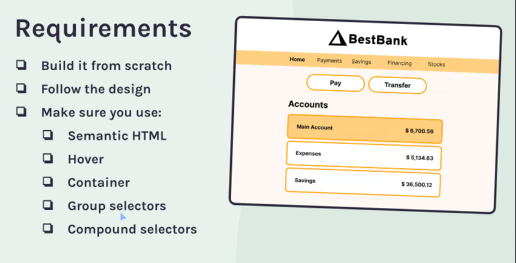
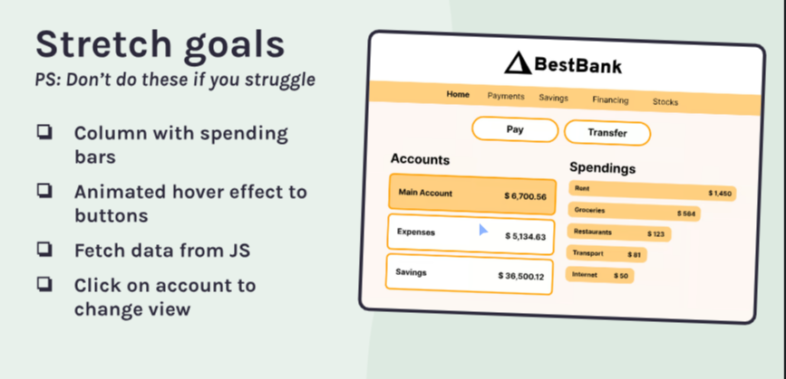

## Bestbank project

Live-demo => https://hueybank.netlify.app/

#### What I've done

In this project, I have used some new fundamentals of CSS and JavaScript concepts to improve my muscle memory such as semantic HTML, hover and active states using pseudo selectors, specificity, compound selectors, querySelector, innerHTML, eventListener, for loop, rendering given data. 

#### what I was asked

